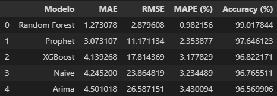

# 📈 Previsão do IBOVESPA com Séries Temporais e Random Forest

Projeto de modelagem preditiva para prever o fechamento diário do índice **IBOVESPA**, utilizando técnicas de **Séries Temporais**, **Feature Engineering** e algoritmos de **Machine Learning (Random Forest, ARIMA, Prophet, XGBoost)**.

---

## 💡 Objetivo

Construir um pipeline preditivo capaz de:
- Extrair dados diários de fechamento da IBOVESPA: https://br.investing.com/indices/bovespa-historical-data
- Prever o valor de fechamento do IBOVESPA para os próximos 3 dias;
- Calcular **intervalos de confiança** para as previsões;
- Analisar desempenho comparativo com diferentes abordagens.

---

## ⚙️ Tecnologias Utilizadas 
          
- **Python 3.10+**
- **Análise de Dados:** `pandas`, `numpy`, `matplotlib`, `datetime` 
- **Machine Learning:** `scikit-learn`, `statsmodels`, `prophet`, `xgboost`
- **Web Scraping:** `BeautifulSoup`, `request`

---

## 📊 Features Criadas

- Lags (`lag_1` a `lag_365`)
- Médias móveis:
  - Simples (`rolling_mean`)
  - Exponencial (`EMA`)
- Desvios padrão
- Tendência linear histórica
- Calendário:
  - `.day` 
  - `.weekofyear`
  - `.month`
  - `.year`


---

## 🔍 Metodologia

1. **Coleta dos dados históricos do IBOVESPA** via `Investing.com`;
2. **Criação de variáveis derivadas** (lags, rolling, ema, etc.);
3. **Treinamento de modelos diversos para benchmarking**;
4. **Análise do modelo Random Forest Regressor**;
5. **Validação e previsão para múltiplos dias futuros (3 dias)**;
6. **Cálculo do intervalo de confiança com base na dispersão das árvores individuais**;
7. **Visualização da previsão, com linha de tendência, faixa de incerteza e naive (baseline)**.

---

## 🏁 Benchmarking
- Os testes utilizados para avaliar a eficiência dos modelos foram:
    - **MAE (Mean Absolute Error)**: é a média das diferenças absolutas entre os valores reais e os valores previstos. Ele mede o erro médio das previsões, sem considerar a direção (positiva ou negativa).
    - **RMSE (Root Mean Squared Error)**: é a raiz quadrada da média dos erros ao quadrado. Ele mede a magnitude média do erro, dando mais peso a erros grandes.
    -  **MAPE (Mean Absolute Percentage Error)**: é a média das diferenças percentuais absolutas entre os valores reais e os valores previstos. Ele mede o erro percentual médio.
    - **Accuracy (%)**: é uma métrica derivada do MAPE. Ela representa a porcentagem de precisão do modelo.



---


## 🗠 Exemplo de Visualização

**Actual:**
Representa os valores reais observados dos dados. Esta série mostra os dados históricos  que estão sendo analisados.

**Previsão Teste RF:**
Indica as previsões feitas pelo modelo Random Forest (RF) para o período de teste. Esta série mostra como o modelo se ajusta aos dados de teste.

**Intervalo de Confiança (RF):**
Representa o intervalo de confiança associado às previsões do Random Forest da base de testes. Considera 95% de confiabilidade.

**Trend Line:**
Uma linha de tendência que pode ser usada para destacar a direção geral dos dados ao longo do tempo. Esta linha ajuda a identificar padrões ou tendência dos próximos dias com base na evolução do ponto inicial do actual até o ponto final.

**Última Cotação Histórica:**
Refere-se ao último valor observado nos dados históricos antes do início das previsões. Este ponto é importante para entender onde os dados reais terminam e as previsões começam.

**Previsão RF (+3 dias):**
Representa as previsões do modelo Random Forest para os próximos três dias. Esta série estende as previsões além do período efetivo e é a principal linha deste estudo.

**IC (+3 dias RF):**
Indica o intervalo de confiança para as previsões dos próximos três dias feitas pelo Random Forest. Considera 95% de confiabilidade.

**Início Previsão Futura:**
Marca o ponto no tempo onde as previsões futuras começam. Este ponto separa os dados históricos das previsões.


---

📂 previsao_ibovespa/
```
├── 📂 Base_de_Dados/                   # Arquivo .csv com dados históricos da IBOVESPA
│   └── 📄 Dados Históricos - Ibovespa.csv
├── 📂 Historico_de_Pred/               # Plotagem gráfica das predições por dia
│   └── 📄 grafico_predicoes.jpeg
├── 📂 Subcodigos/                      # Códigos auxiliares (benchmark de modelos e scraping)
│   ├── 📄 benchmarking_models.ipynb
│   └── 📄 scraping_ibov_data.ipynb
├── 📄 App_Random Forest Predct.ipynb   # Código com foco apenas no modelo Random Forest (melhor performance)
├── 📄 Machine_Code.ipynb               # Pipeline completo com todo o código de pré-processamento, modelagem e previsão
├── 📄 Benchmarking.png                 # Imagem de Benchmarking
└── 📄 README.md                        # Documentação do projeto
```

---

## 🔜 Próximas Etapas

- Adição de novos modelos: **SARIMA, LSTM**
- Avaliação por métricas: **MAPE, RMSE, MAE**
- Automatização via pipeline modular
- Otimização de hiperparâmetros
- Scraping por intervalo de última data da base de dados até a data de hoje

---

## 👨‍💻 Contato: **Luis Rufino — Analista de Dados**  
[](https://www.linkedin.com/in/luis-henrique-rufino-2341901b2/)


---

## 📃 Licença

Este projeto está licenciado sob a **MIT License**.
